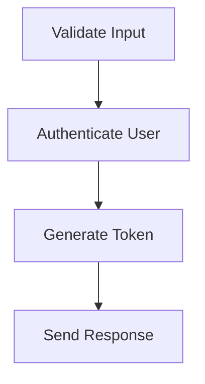

# 🌌 Visualizing Middleware Flows 🌌
When working with Middleware-Oriented Architecture (MOA), especially in complex applications, understanding the sequence and interplay of middlewares becomes paramount. Just as a well-organized chart can illustrate the flow of a multi-step process, visualizing middleware flows can offer a clearer perspective of the app's logic, dependencies, and behavior. This clarity is not just beneficial for developers diving into the code, but also for architects designing the system and for new team members trying to understand its intricacies.

In this section, we'll delve into the importance of visual representations for middleware sequences, tools that aid in this visualization, and how such visual aids can enhance the overall design and maintenance of MOA-based applications.

## 🧜‍♀️ Using Mermaid to trace middleware graphs 🧜‍♀️

Mermaid is a popular tool for generating diagrams and flowcharts using simple markup language. Its lightweight nature and the ability to embed within markdown documents make it an excellent choice for visualizing middleware flows in MOA applications.

**Why Mermaid**?

*Simplicity*: Mermaid's syntax is intuitive, allowing developers to quickly jot down middleware sequences without the steep learning curve of more complex diagramming tools.

*Integration with Documentation*: Since Mermaid can be embedded within markdown, it fits seamlessly into project documentation, READMEs, and wikis.

*Collaboration*: Text-based diagrams can be version-controlled, making it easier for teams to collaborate, review, and track changes.

**Example: Visualizing an Authentication Flow**

Let's consider a simple MOA application handling user authentication:

```javascript
app.post("/login", validateInput, authenticateUser, generateToken, sendResponse);
```

This flow can be visualized in Mermaid as:



The above Mermaid code produces a straightforward flowchart depicting the sequence of middlewares for the login endpoint.

**Tips for Using Mermaid in MOA**

*Group Common Middlewares*: If certain middlewares are frequently used together, group them into a single node for simplicity. For instance, a group of validation middlewares can be represented as a single "Validation" node.

*Highlight Critical Pathways*: Use colors or different shapes to indicate critical flows or potential bottlenecks, such as error handling or third-party integrations.

*Annotate where needed*: Add notes or annotations to clarify specific behaviors or dependencies between middlewares.

By integrating tools like Mermaid into the development and documentation process, MOA projects can gain clarity, become more maintainable, and enhance collaboration among developers.

## 🤖 Automating Graph Generation from Project Sources 🤖

As MOA applications evolve and scale, keeping middleware flow diagrams up-to-date can become a chore. However, the real power of visualization tools like Mermaid can be harnessed when we automate the generation of these diagrams based on the actual source code of the project. This ensures that our visual representations are always in sync with the current state of the application.

**Why Automate**?

*Accuracy*: Manual updates to diagrams can be error-prone. Automation guarantees that the visual representation matches the codebase.

*Efficiency*: No need to redraw or restructure the flowchart with each change in the middleware sequence.

*Consistency*: A uniform way of visualizing across different parts or versions of the application.

**Basic Approach**:

The general idea is to parse the source code, identify the sequences of middleware, and then generate a corresponding Mermaid diagram markup.

*Example*:

Consider an Express.js route:

```javascript
app.get("/user", authenticate, fetchUserDetails, sendResponse);
```

A simple parser can extract the middleware names from this line and then generate the corresponding Mermaid code.

**Steps to Automate**:

*Source Code Parsing*: Use tools like Esprima for JavaScript to generate an Abstract Syntax Tree (AST) of your source code.

*Middleware Extraction*: Traverse the AST and identify the middleware sequences. Look for patterns typical to Express route definitions.

*Mermaid Markup Generation*: Convert the extracted middleware sequences into Mermaid markup.

*Integration with Documentation*: Embed the generated Mermaid markup into markdown files or documentation platforms.

**Potential Challenges**:

*Complex Logic*: Not all routes are straightforward. Handling conditional middlewares, dynamically added middlewares, or those added via other means can be challenging.

*Performance*: Parsing and generating diagrams on-the-fly for large codebases might impact build or deployment times.

*Version Control*: Ensure that automated changes to documentation are trackable and do not clutter version history.

Incorporating automation into the visualization process ensures that developers always have an accurate and immediate visual aid for understanding the middleware flows, making the MOA approach even more transparent and maintainable.
